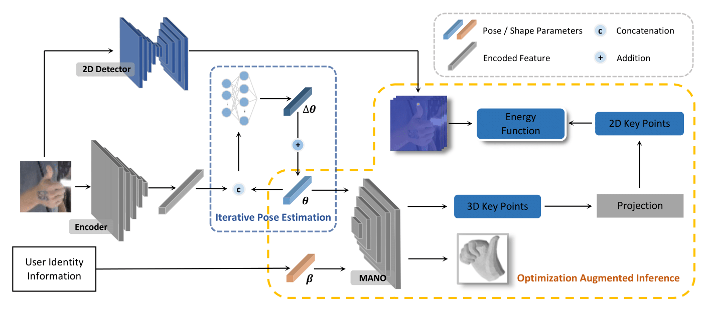

# Identity-Aware Hand Mesh Estimation and Personalization from RGB Images
\[ECCV2022\] "Identity-Aware Hand Mesh Estimation and Personalization from RGB Images".

<p align="center">

</p>

## Introduction
This repo is the PyTorch implementation of ECCV2022 paper "Identity-Aware Hand Mesh Estimation and Personalization from RGB Images". 
You can find this paper from [paper link](https://arxiv.org/pdf/2209.10840.pdf).

## Install 
+ Environment for IDentity-Aware Hand Mesh Estimation (IdHandMesh)
    ```
    conda create -n IdHandMesh python=3.8   
    conda activate IdHandMesh
    ```
+ Please follow [official suggestions](https://pytorch.org/) to install pytorch and torchvision. We use pytorch=1.7.1, torchvision=0.8.2
+ Requirements

  Please see `environment.yaml`.

+ Install MANO from [MANO](https://github.com/hassony2/manopth).

+ Note that `torch_sparse` and `MPI-IS Mesh` are required for the CMR model (one of the methods our method is compared to).

  a) If you have difficulty in installing `torch_sparse` etc., please use `whl` file from [here](https://pytorch-geometric.com/whl/).
  
  b) [MPI-IS Mesh](https://github.com/MPI-IS/mesh): We suggest to install this library from the source.

  More details can be found at [CMR](https://github.com/SeanChenxy/HandMesh).


## Dataset
#### Dex_YCB
+ Please download DEX-YCB dataset from [this link](https://dex-ycb.github.io/), 
and create a soft link in `data`, i.e., `data/dex_ycb`. Inside the folder 'datasets', 
run the following scripts to process the data.
  ```
  python split_annotations_with_cropping.py
  python get_rest_hand_mesh.py
  ```
+ After processing the data, you should have the following directory struction.
  ```  
  ${ROOT} 
  |-- conv
  |   |-- ...
  |-- data
  |   |-- dex_ycb
  |   |   |-- 20200709-subject-01
  |   |   |-- 20200813-subject-02
  |   |   |-- ...
  |   |   |-- 20201022-subject-10
  |   |   |-- 20201022-subject-10
  |   |   |-- 20201022-subject-10
  |   |   |-- bop
  |   |   |-- calibration
  |   |   |-- cropped_hand_size_2         # generated by our .py file
  |   |   |-- models
  |   |   |-- split_annotations           # generated by our .py file
  |-- datasets
  |   |-- dex_ycb
  |   |   |-- ...
  |-- options
  |-- out
  |-- scripts
  |-- src
  |-- template
  |   |-- dex_ycb_j_regressor.npy
  |   |-- MANO_RIGHT.pkl
  |   |-- template.ply 
  |   |-- transform.pkl
  |-- utils
  |   |-- ...
  |-- ....py
  ```  

## Reproducing the baseline and our method.
+ Training 
  
  a) Train the baseline model.
  ```
  ./scripts/train_dex_ycb_mano_based_baseline.sh
  ```
  b) Train the our model with ground truth hand shape.
  ```
  ./scripts/train_dex_ycb_mano_based_our_model_with_gt_shape.sh
  ```
  c) Train baseline with confidence branch. (only train the confidence branch, other parts are frozen).
  ```
  ./scripts/train_dex_ycb_mano_based_conf_branch.sh
  ```
+ Run hand shape calibration.

  a) Get results from the baseline model
    ```
    python mis_dex_ycb_get_predictions_baseline_with_conf.py
    ```
  b) Perform calibration
    ```
    python calibrate_from_shape_params.py
    ```
+ Evaluate the performance without optimizatin module.

  a) Baseline performance
    ```
    ./scripts/eval_dex_ycb_mano_based_baseline.sh
    ```
  b) Our model when fed with groundtruth hand shape
    ```
    ./scripts/eval_dex_ycb_ours_gt_hand_shape.sh
    ```
  c) Our model when fed with calibrated hand shape
    ```
    ./scripts/eval_dex_ycb_ours_calibrated_hand_shape.sh
    ```
+ Optimizatin module during inference.

  Get 2d predictions.
  ```
  python mis_dex_ycb_get_predictions_2d.py
  ```
  Run optimization and evaluate at the same time.

  a) Baseline performance
    ```
    python optimization_dex_ycb_baseline.py
    ```
  b) Our model when fed with groundtruth hand shape
    ```
    python optimization_dex_ycb_ours_with_gt_hand_shape.py
    ```
  c) Our model when fed with calibrated hand shape
    ```
    python optimization_dex_ycb_ours_with_calibrated_hand_shape.py
    ```


## Reproducing the methods being compared to.

+ CMR
  ```
  ./scripts/train_dex_ycb_cmr.sh
  ./scripts/eval_dex_ycb_cmr.sh
  ```
+ Boukhayma’s model
  ```
  ./scripts/train_dex_ycb_boukhayma
  ./scripts/eval_dex_ycb_boukhayma.sh
  ```
+ Metro

  Install [Metro](https://github.com/microsoft/MeshTransformer) and then use the following script to generate the tsv file for DEX_YCB.
  ```
  metro_utils/tsv_demo_dex_ycb.py
  ```
  
## Reference

  ```
  @inproceedings{kong2022identity,
  title={Identity-Aware Hand Mesh Estimation and Personalization from RGB Images},
  author={Kong, Deying and Zhang, Linguang and Chen, Liangjian and Ma, Haoyu and Yan, Xiangyi and Sun, Shanlin and Liu, Xingwei and Han, Kun and Xie, Xiaohui},
  booktitle={Computer Vision--ECCV 2022: 17th European Conference, Tel Aviv, Israel, October 23--27, 2022, Proceedings, Part V},
  pages={536--553},
  year={2022}
}
  ```

## Acknowledgement
Our implementation is developed with the help of the following open sourced projects:

+ [spiralnet_plus](https://github.com/sw-gong/spiralnet_plus?utm_source=catalyzex.com).
+ [CMR](https://github.com/SeanChenxy/HandMesh)
+ [Boukhayam's MANO-based Model](https://github.com/boukhayma/3dhand)
+ [Metro](https://github.com/microsoft/MeshTransformer)
+ [MANO](https://github.com/hassony2/manopth)

Please also consider cite the above projects if you find them helpful.
